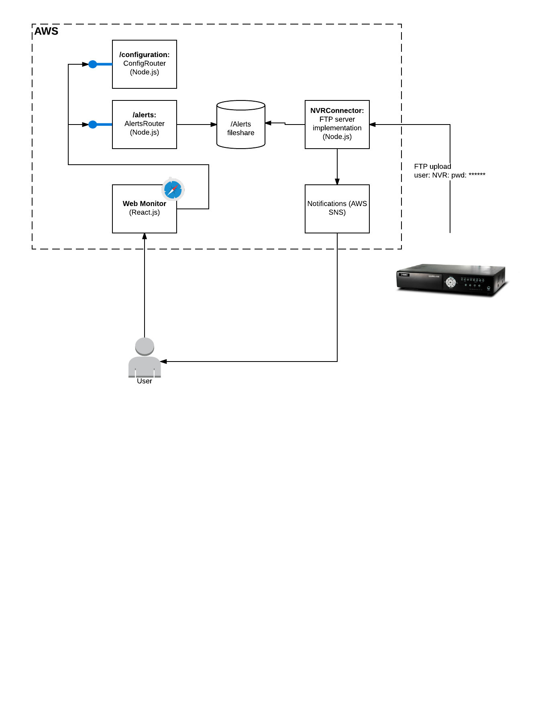

# VideoMonitor
Remote video monitoring system in Node.js/Express and React.

## VM system diagram
VM main components represented on the schematic diagram below:

* **NVR** (Network Video Recorder) - this is the appliance that talks to all cams connected, keeps data streamed by cams, detects motions and raises alerts. Most of the modern NVRs have FTP upload for the video clips wich caused alerts and this is how VM is intergated with NVR. There is FTP protocol implemented by VM and NVR is configured to use specific FTP IP and port provided by VM application. Then once an alert is raised by NVR, it will upload the video file to VM system and VM handles the upload to receive the data.
* faksjdfjf;
